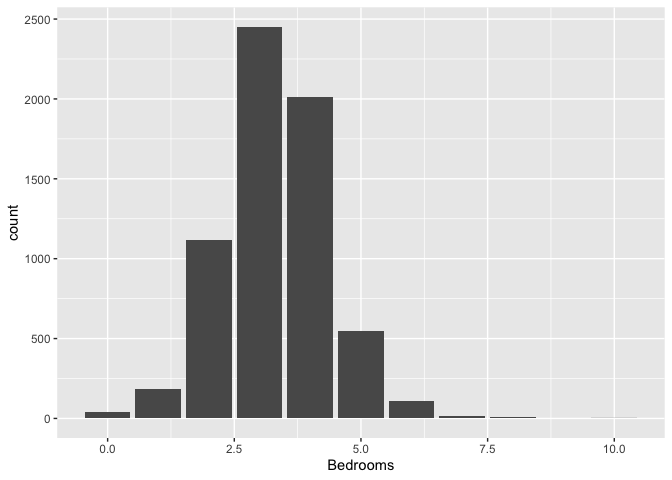

<!-- README.md is generated from README.Rmd. Please edit the README.Rmd file -->

# Lab report \#1

Follow the instructions posted at
<https://ds202-at-isu.github.io/labs.html> for the lab assignment. The
work is meant to be finished during the lab time, but you have time
until Monday evening to polish things.

Include your answers in this document (Rmd file). Make sure that it
knits properly (into the md file). Upload both the Rmd and the md file
to your repository.

All submissions to the github repo will be automatically uploaded for
grading once the due date is passed. Submit a link to your repository on
Canvas (only one submission per team) to signal to the instructors that
you are done with your submission.

    ## Warning: package 'ggplot2' was built under R version 4.2.3

    ## Warning: package 'tibble' was built under R version 4.2.3

    ## Warning: package 'dplyr' was built under R version 4.2.3

    ## # A tibble: 6,935 × 1
    ##    Bedrooms
    ##       <dbl>
    ##  1        2
    ##  2        1
    ##  3        3
    ##  4        4
    ##  5       NA
    ##  6        4
    ##  7        5
    ##  8        1
    ##  9        3
    ## 10        4
    ## # ℹ 6,925 more rows

    ## Warning: Removed 447 rows containing non-finite values (`stat_count()`).

<!-- -->
\<\<\<\<\<\<\< HEAD There are a lot 2-5 bedroom houses

<!-- -->
\>\>\>\>\>\>\> dcc921aafe5f937a2d470b66da60519b39b91d80
