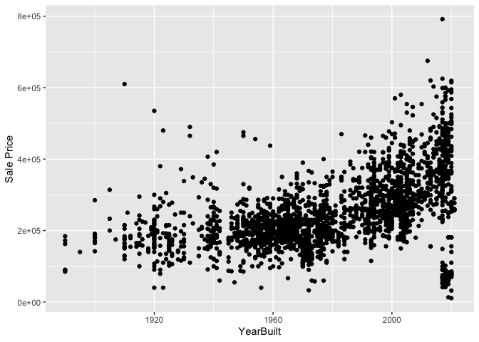
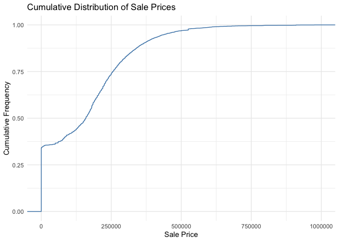
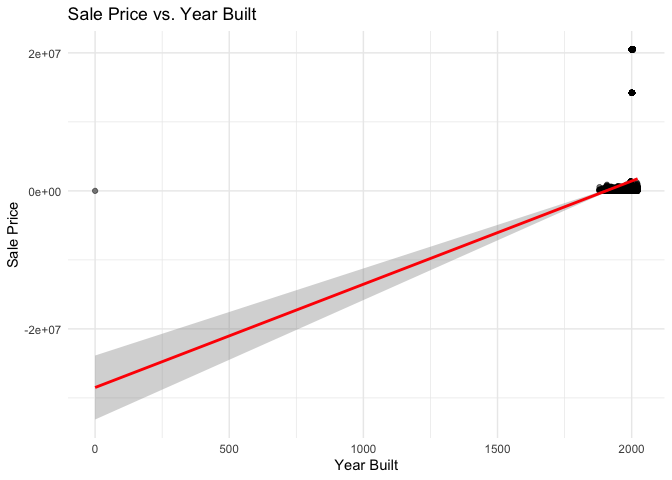
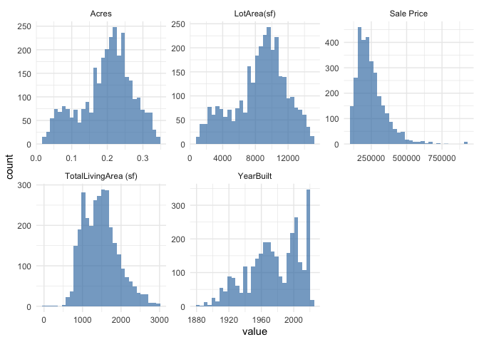
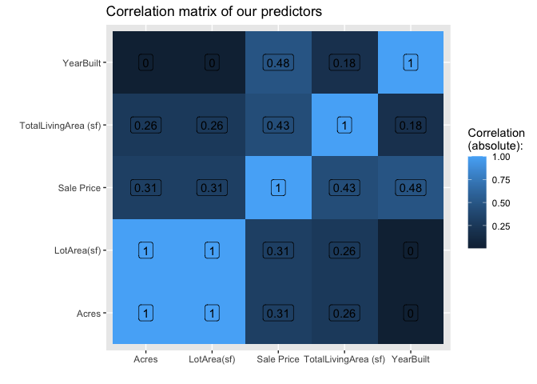
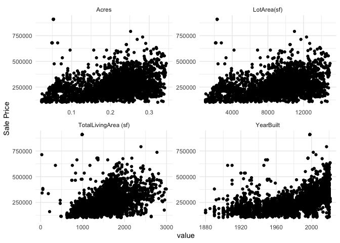
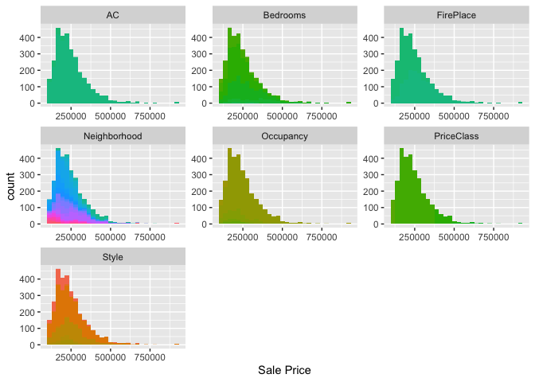
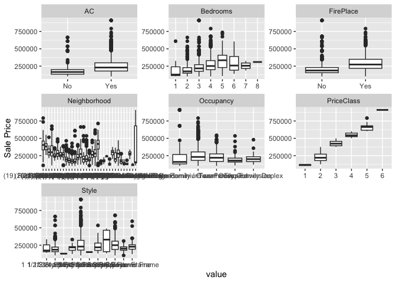
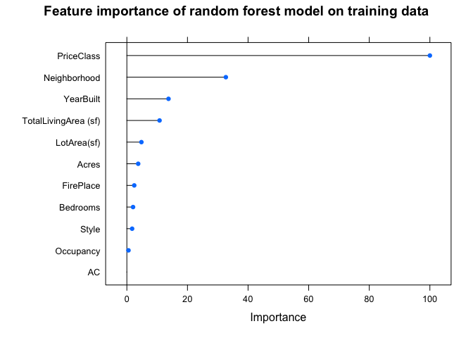
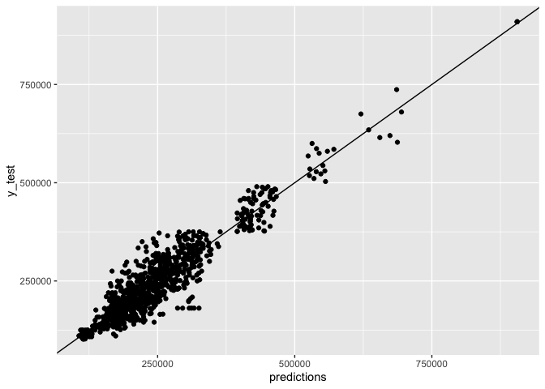

<!-- README.md is generated from README.Rmd. Please edit the README.Rmd file -->

# Lab report \#1

Follow the instructions posted at
<https://ds202-at-isu.github.io/labs.html> for the lab assignment. The
work is meant to be finished during the lab time, but you have time
until Monday evening to polish things.

Include your answers in this document (Rmd file). Make sure that it
knits properly (into the md file). Upload both the Rmd and the md file
to your repository.

All submissions to the github repo will be automatically uploaded for
grading once the due date is passed. Submit a link to your repository on
Canvas (only one submission per team) to signal to the instructors that
you are done with your submission.

TL;DR

``` r
#install.packages('remotes')
#remotes::install_github("heike/classdata")
library(ggplot2)
```

    ## [1] 6935   16

    ## tibble [6,935 × 16] (S3: tbl_df/tbl/data.frame)
    ##  $ Parcel ID            : chr [1:6935] "0903202160" "0907428215" "0909428070" "0923203160" ...
    ##  $ Address              : chr [1:6935] "1024 RIDGEWOOD AVE, AMES" "4503 TWAIN CIR UNIT 105, AMES" "2030 MCCARTHY RD, AMES" "3404 EMERALD DR, AMES" ...
    ##  $ Style                : Factor w/ 12 levels "1 1/2 Story Brick",..: 2 5 5 5 NA 9 5 5 5 5 ...
    ##  $ Occupancy            : Factor w/ 5 levels "Condominium",..: 2 1 2 3 NA 2 2 1 2 2 ...
    ##  $ Sale Date            : Date[1:6935], format: "2022-08-12" "2022-08-04" ...
    ##  $ Sale Price           : num [1:6935] 181900 127100 0 245000 449664 ...
    ##  $ Multi Sale           : chr [1:6935] NA NA NA NA ...
    ##  $ YearBuilt            : num [1:6935] 1940 2006 1951 1997 NA ...
    ##  $ Acres                : num [1:6935] 0.109 0.027 0.321 0.103 0.287 0.494 0.172 0.023 0.285 0.172 ...
    ##  $ TotalLivingArea (sf) : num [1:6935] 1030 771 1456 1289 NA ...
    ##  $ Bedrooms             : num [1:6935] 2 1 3 4 NA 4 5 1 3 4 ...
    ##  $ FinishedBsmtArea (sf): num [1:6935] NA NA 1261 890 NA ...
    ##  $ LotArea(sf)          : num [1:6935] 4740 1181 14000 4500 12493 ...
    ##  $ AC                   : chr [1:6935] "Yes" "Yes" "Yes" "Yes" ...
    ##  $ FirePlace            : chr [1:6935] "Yes" "No" "No" "No" ...
    ##  $ Neighborhood         : Factor w/ 42 levels "(0) None","(13) Apts: Campus",..: 15 40 19 18 6 24 14 40 13 23 ...

## Types of Data

There are 16 columns with variables:

-   Parcel ID: Useless, just an identifier
-   Address: Kinda Useless
-   Style: IMPORTANT, CATEGORICAL
-   Occupancy: IMPORTANT, CATEGORICAL
-   Sale Date: Maybe important for time series analysis. most likely
    QUANTITATIVE
-   Sale Price: IMPORTANT, QUANTITATIVE (MAIN VARIABLE); RANGE: \$0 -
    \$22,000,000
-   Multi Sale: CATEGORICAL (mostly NAs, watch out!) Useless in my
    opinion
-   YearBuilt: Important for time series analysis. Most likely
    QUANTITATIVE; RANGE: 0 - 2022
-   Acres: IMPORTANT, QUANTITATIVE; RANGE: 0 - 12.012
-   TotalLivingArea (sf): IMPORTANT, QUANTITATIVE; RANGE: 0 - 6007
-   Bedrooms: IMPORTANT, CATEGORICAL
-   FinishedBsmtArea (sf): IMPORTANT, QUANTITATIVE; RANGE: 10 - 6496
-   LotArea(sf): IMPORTANT, QUANTITATIVE; RANGE: 0 - 523228
-   AC: IMPORTANT, CATEGORICAL
-   FirePlace: IMPORTANT, CATEGORICAL
-   Neighborhood: IMPORTANT, CATEGORICAL

**NOTE:** - Most of the plots won’t be done for max range of values
because they might heavily skew the plots - See [detailed visualization
file called exploration\_workspace.R in our
repo](exploration_workspace.R) for all the various trends.  
We picked couple important ones for this document.  
DO NOT CLICK THE LINK FROM HTML AFTER KNITTING, THE LINK ONLY WORKS FOR
README.md ON GITHUB

    ## # A tibble: 6,935 × 1
    ##    Bedrooms
    ##       <dbl>
    ##  1        2
    ##  2        1
    ##  3        3
    ##  4        4
    ##  5       NA
    ##  6        4
    ##  7        5
    ##  8        1
    ##  9        3
    ## 10        4
    ## # ℹ 6,925 more rows

<!-- --><!-- -->

There are a lot of 2-5 bedroom houses

<!-- -->

### Boxplots for `Sale Price`

Let’s analyze boxplots of `Sale Price` for various types

#### By `Bedrooms`

<!-- -->

As you can see, the higher the bedrooms, the higher the sale price

#### By `Style`

<!-- -->

As you can see, 2 Story Brick has no outliers (every other type has
outliers). It also has the highest IQR, possibly lots of variety in such
houses for people to buy.

1 Story Frame has the highest range, however, most of the houses bought
lie around \$150,000 to \$300,000

### Useful scatterplots and line plots

Let’s now see some quantitative VS quantitative action

#### Let’s see `YearBuilt` VS `Sale Price`

<!-- -->

We see that overall trend seems to rise rapidly as we approach the 21st
century.

We also see that there are some very cheap houses in the 21st century,
maybe government offered good programs or there was a housing market
crash.

Let’s also see the trend more clearly by looking at average price per
year

<!-- -->

The rising trend near the 21th century is much more apparent now.

Let’s also see how sale price varied for say, `Occupancy`

<!-- -->

Townhouse trend started after 1960s. All types exhibit rising trend,
however, two family duplex was expensive around 1920s but fell off
later, rose a little bit but relatively stable.

#### Let’s see `LotArea(sf)` VS `Sale Price`

Let’s also throw in a category `Occupancy` while we’re at it

<!-- -->

We notice interesting patterns.

Townhouses usually have a smaller area but price rises rapidly as area
increases.

Two Family conversion has a slight increase with area.

Single family/owner occupied is clearly the most popular and is usually
larger area than townhouses and has wide price range.

\#Varun: Question 1)

# Display the structure of the Ames dataset

``` r
str(ames)
```

    ## tibble [6,935 × 16] (S3: tbl_df/tbl/data.frame)
    ##  $ Parcel ID            : chr [1:6935] "0903202160" "0907428215" "0909428070" "0923203160" ...
    ##  $ Address              : chr [1:6935] "1024 RIDGEWOOD AVE, AMES" "4503 TWAIN CIR UNIT 105, AMES" "2030 MCCARTHY RD, AMES" "3404 EMERALD DR, AMES" ...
    ##  $ Style                : Factor w/ 12 levels "1 1/2 Story Brick",..: 2 5 5 5 NA 9 5 5 5 5 ...
    ##  $ Occupancy            : Factor w/ 5 levels "Condominium",..: 2 1 2 3 NA 2 2 1 2 2 ...
    ##  $ Sale Date            : Date[1:6935], format: "2022-08-12" "2022-08-04" ...
    ##  $ Sale Price           : num [1:6935] 181900 127100 0 245000 449664 ...
    ##  $ Multi Sale           : chr [1:6935] NA NA NA NA ...
    ##  $ YearBuilt            : num [1:6935] 1940 2006 1951 1997 NA ...
    ##  $ Acres                : num [1:6935] 0.109 0.027 0.321 0.103 0.287 0.494 0.172 0.023 0.285 0.172 ...
    ##  $ TotalLivingArea (sf) : num [1:6935] 1030 771 1456 1289 NA ...
    ##  $ Bedrooms             : num [1:6935] 2 1 3 4 NA 4 5 1 3 4 ...
    ##  $ FinishedBsmtArea (sf): num [1:6935] NA NA 1261 890 NA ...
    ##  $ LotArea(sf)          : num [1:6935] 4740 1181 14000 4500 12493 ...
    ##  $ AC                   : chr [1:6935] "Yes" "Yes" "Yes" "Yes" ...
    ##  $ FirePlace            : chr [1:6935] "Yes" "No" "No" "No" ...
    ##  $ Neighborhood         : Factor w/ 42 levels "(0) None","(13) Apts: Campus",..: 15 40 19 18 6 24 14 40 13 23 ...

Question 2)

I am interested in sale price becuase I believe it is a key variable for
real estate analysis.

``` r
# Summary of Sale Price
summary(ames$`Sale Price`)
```

    ##     Min.  1st Qu.   Median     Mean  3rd Qu.     Max. 
    ##        0        0   170900  1017479   280000 20500000

I believe the numbers show that most houses in Ames sell for around
170,900, which seems like the normal price for a house there. But there
are some houses that sold for a lot more, making the average price look
really high at 1,017,479. Also, some houses are listed with a sale price
of 0, which is strange and might be a mistake or something special about
those sales. So, I think if we don’t count those unusual 0 and super
high prices, we’d get a clearer picture of what most houses really cost
in Ames.

Question 3)

``` r
# Histogram for Sale Price
ggplot(ames, aes(x=`Sale Price`)) +
  geom_histogram(binwidth = 20000, fill = "steelblue", color = "black") +
  labs(title = "Histogram of Sale Prices", x = "Sale Price", y = "Frequency") +
  theme_minimal()
```

<!-- -->

``` r
ggplot(ames, aes(x=`Sale Price`)) +
  geom_histogram(binwidth = 50000, fill = "dodgerblue", color = "black") +
  xlim(c(0, 1000000)) +  # Limiting x-axis to focus on the common range
  labs(title = "Distribution of Sale Prices", x = "Sale Price", y = "Count") +
  theme_minimal()
```

<!-- -->

``` r
ggplot(ames, aes(x=`Sale Price`)) +
  geom_density(fill="salmon", alpha=0.5) +
  xlim(c(0, 1000000)) +  # Focus on the common price range
  labs(title = "Density of Sale Prices", x = "Sale Price", y = "Density") +
  theme_minimal()
```

<!-- -->

``` r
ggplot(ames, aes(x=`Sale Price`)) +
  stat_ecdf(geom = "step", color="steelblue") +
  xlim(c(0, 1000000)) +  # Focus on the common price range
  labs(title = "Cumulative Distribution of Sale Prices", x = "Sale Price", y = "Cumulative Frequency") +
  theme_minimal()
```

<!-- -->

Main Variable: Sale Price Range of Sale Price The range of “Sale Price”
was already identified in the summary provided earlier, with a minimum
of 0 and a maximum of 20,500,000. However, the presence of 0 values
suggests some transactions might not represent actual sales.

``` r
# Bar chart for Bedrooms
ggplot(ames, aes(x=factor(Bedrooms))) +
  geom_bar(fill = "steelblue", color = "black") +
  labs(title = "Distribution of Bedrooms", x = "Number of Bedrooms", y = "Count") +
  theme_minimal()
```

<!-- -->

4.  

Range of Total Living Area

``` r
summary(ames$`TotalLivingArea (sf)`)
```

    ##    Min. 1st Qu.  Median    Mean 3rd Qu.    Max.    NA's 
    ##       0    1095    1460    1507    1792    6007     447

The statistics for the ‘TotalLivingArea (sf)’ variable in the dataset
reveal a broad range, with a minimum of 0 square feet, suggesting
possible data errors, and a maximum of 6,007 square feet, indicating a
diverse property size spectrum. The first quartile is at 1,095 square
feet, the median is 1,460 square feet, and the third quartile is at
1,792 square feet, with an average living area of approximately 1,507
square feet. This average, being higher than the median, hints at a
right-skewed distribution with some exceptionally large properties.
Additionally, there are 447 entries without recorded living area data,
which could impact the analysis and might necessitate data cleaning or
imputation.

``` r
range(classdata::ames$Bedrooms, na.rm = TRUE)
```

    ## [1]  0 10

``` r
bar_chart_bedrooms <- ggplot(classdata::ames, aes(x=as.factor(Bedrooms))) +
  geom_bar(fill="steelblue", color="black", alpha=0.7) +
  labs(title="Distribution of Number of Bedrooms", x="Number of Bedrooms", y="Frequency") +
  theme_minimal()

print(bar_chart_bedrooms)
```

<!-- -->

I think there are oddities in the barchart between frequency and number
of bedrooms.I believe there are a couple of notable oddities. Firstly,
the bar for 0 bedrooms is peculiar, as typically a property would have
at least one bedroom; this suggests either a data entry error or a
unique type of dwelling that is not meant for typical residence, like a
studio. Secondly, there’s a bar for 10 bedrooms which is quite unusual
for standard homes, indicating that this could be a large multi-family
dwelling or a data anomaly. Lastly, the ‘NA’ category is present,
implying that there are properties with unspecified bedroom counts,
which could impact the analysis if these entries are significant in
number. It might be necessary to investigate these anomalies to ensure
accurate data analysis.

``` r
boxplot_sale_price_vs_bedrooms <- ggplot(classdata::ames, aes(x=as.factor(Bedrooms), y=`Sale Price`)) +
  geom_boxplot(fill="steelblue", color="black", alpha=0.7) +
  labs(title="Boxplot of Sale Prices by Number of Bedrooms", x="Number of Bedrooms", y="Sale Price") +
  theme_minimal()

print(boxplot_sale_price_vs_bedrooms)
```

<!-- -->

The boxplot depicting sale prices by the number of bedrooms shows a wide
variation in one-bedroom properties and outliers in several categories,
suggesting diverse property types or data inconsistencies. The ‘NA’
category indicates missing bedroom information, and the presence of a
ten-bedroom category could reflect exceptionally large residences. The
lack of a clear price trend with increasing bedrooms and the scientific
notation on the y-axis suggests a vast range of sale prices.

After reviewing all the graphs, it looks like the sale prices of houses
vary a lot, especially for homes with just one bedroom. Also, there are
some homes with a lot of bedrooms that have prices that are really
different from the rest. It’s not always true that more bedrooms mean a
more expensive house. There’s also some information missing for some
houses (like how many bedrooms they have), which makes it harder to see
clear patterns.

\#Fun

``` r
ggplot(ames, aes(x=YearBuilt, y=`Sale Price`)) +
  geom_point(alpha = 0.5) +
  geom_smooth(method = "lm", color = "red") +
  labs(title = "Sale Price vs. Year Built", x = "Year Built", y = "Sale Price") +
  theme_minimal()
```

    ## `geom_smooth()` using formula = 'y ~ x'

<!-- -->

``` r
ggplot(ames, aes(x=Neighborhood, y=`Sale Price`)) +
  geom_boxplot() +
  theme(axis.text.x = element_text(angle = 45, hjust = 1)) +
  labs(title = "Sale Price by Neighborhood", x = "Neighborhood", y = "Sale Price")
```

<!-- --> This graph
shows how much houses are sold for in different neighborhoods. Most
places have homes sold for around the same prices, but there’s one
neighborhood on the right where houses are much more expensive. This
neighborhood also has houses with a big range of prices, from kind of
expensive to super expensive. This probably means this is a fancy area.

# MACHINE LEARNING!!!

### Data exploration/visualization for ML

Let’s explore data for ML purposes

<!-- --><!-- --><!-- --><!-- --><!-- -->

We notice not much correlations. Also varying behavior based on various
factors. So simple linear regression or clustering won’t work.

### Model training

Let’s use Random Forest Regression as decision trees certainly help
determine the important features.

    ## + Fold1: mtry= 1 
    ## - Fold1: mtry= 1 
    ## + Fold1: mtry= 2 
    ## - Fold1: mtry= 2 
    ## + Fold1: mtry= 3 
    ## - Fold1: mtry= 3 
    ## + Fold1: mtry= 4 
    ## - Fold1: mtry= 4 
    ## + Fold1: mtry= 5 
    ## - Fold1: mtry= 5 
    ## + Fold1: mtry= 6 
    ## - Fold1: mtry= 6 
    ## + Fold1: mtry= 7 
    ## - Fold1: mtry= 7 
    ## + Fold1: mtry= 8 
    ## - Fold1: mtry= 8 
    ## + Fold1: mtry= 9 
    ## - Fold1: mtry= 9 
    ## + Fold1: mtry=10 
    ## - Fold1: mtry=10 
    ## + Fold1: mtry=11 
    ## - Fold1: mtry=11 
    ## + Fold2: mtry= 1 
    ## - Fold2: mtry= 1 
    ## + Fold2: mtry= 2 
    ## - Fold2: mtry= 2 
    ## + Fold2: mtry= 3 
    ## - Fold2: mtry= 3 
    ## + Fold2: mtry= 4 
    ## - Fold2: mtry= 4 
    ## + Fold2: mtry= 5 
    ## - Fold2: mtry= 5 
    ## + Fold2: mtry= 6 
    ## - Fold2: mtry= 6 
    ## + Fold2: mtry= 7 
    ## - Fold2: mtry= 7 
    ## + Fold2: mtry= 8 
    ## - Fold2: mtry= 8 
    ## + Fold2: mtry= 9 
    ## - Fold2: mtry= 9 
    ## + Fold2: mtry=10 
    ## - Fold2: mtry=10 
    ## + Fold2: mtry=11 
    ## - Fold2: mtry=11 
    ## Aggregating results
    ## Selecting tuning parameters
    ## Fitting mtry = 8 on full training set

After model is trained, let’s see most important features, RMSE and our
prediction VS actual plots.

<!-- -->

    ## Random Forest 
    ## 
    ## 2164 samples
    ##   11 predictor
    ## 
    ## No pre-processing
    ## Resampling: Cross-Validated (2 fold) 
    ## Summary of sample sizes: 1082, 1082 
    ## Resampling results across tuning parameters:
    ## 
    ##   mtry  RMSE      Rsquared   MAE     
    ##    1    56018.70  0.7627894  38584.07
    ##    2    44791.25  0.8224295  31701.84
    ##    3    41015.38  0.8464294  30021.61
    ##    4    39018.76  0.8585883  29157.65
    ##    5    38061.80  0.8637313  28721.30
    ##    6    37230.19  0.8684138  28236.25
    ##    7    37078.88  0.8688266  28070.35
    ##    8    37034.46  0.8686609  28039.95
    ##    9    37133.23  0.8676598  28065.69
    ##   10    37212.81  0.8668685  28107.78
    ##   11    37298.72  0.8661576  28061.89
    ## 
    ## RMSE was used to select the optimal model using the smallest value.
    ## The final value used for the model was mtry = 8.

<!-- -->

Most important feature is price class followed by neighborhood which
makes sense.

We see our model predicts quite accurately. Will optimize further for
finer tuning later.
