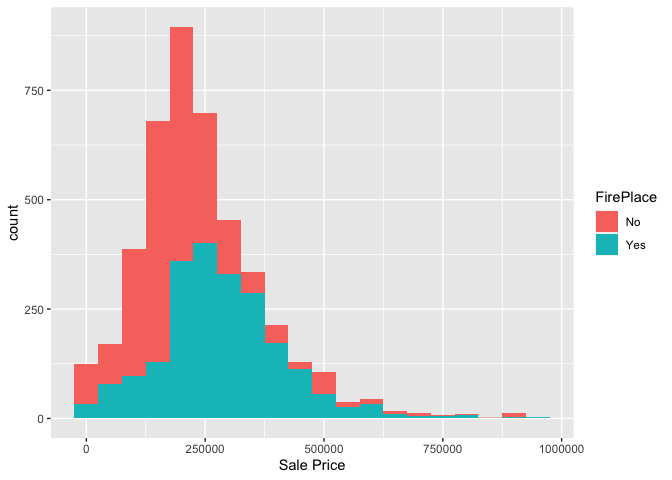
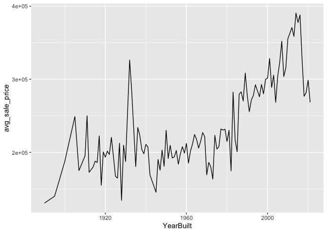

<!-- README.md is generated from README.Rmd. Please edit the README.Rmd file -->

# Lab report \#1

Follow the instructions posted at
<https://ds202-at-isu.github.io/labs.html> for the lab assignment. The
work is meant to be finished during the lab time, but you have time
until Monday evening to polish things.

Include your answers in this document (Rmd file). Make sure that it
knits properly (into the md file). Upload both the Rmd and the md file
to your repository.

All submissions to the github repo will be automatically uploaded for
grading once the due date is passed. Submit a link to your repository on
Canvas (only one submission per team) to signal to the instructors that
you are done with your submission.

TL;DR

    ## [1] 6935   16

    ## tibble [6,935 × 16] (S3: tbl_df/tbl/data.frame)
    ##  $ Parcel ID            : chr [1:6935] "0903202160" "0907428215" "0909428070" "0923203160" ...
    ##  $ Address              : chr [1:6935] "1024 RIDGEWOOD AVE, AMES" "4503 TWAIN CIR UNIT 105, AMES" "2030 MCCARTHY RD, AMES" "3404 EMERALD DR, AMES" ...
    ##  $ Style                : Factor w/ 12 levels "1 1/2 Story Brick",..: 2 5 5 5 NA 9 5 5 5 5 ...
    ##  $ Occupancy            : Factor w/ 5 levels "Condominium",..: 2 1 2 3 NA 2 2 1 2 2 ...
    ##  $ Sale Date            : Date[1:6935], format: "2022-08-12" "2022-08-04" ...
    ##  $ Sale Price           : num [1:6935] 181900 127100 0 245000 449664 ...
    ##  $ Multi Sale           : chr [1:6935] NA NA NA NA ...
    ##  $ YearBuilt            : num [1:6935] 1940 2006 1951 1997 NA ...
    ##  $ Acres                : num [1:6935] 0.109 0.027 0.321 0.103 0.287 0.494 0.172 0.023 0.285 0.172 ...
    ##  $ TotalLivingArea (sf) : num [1:6935] 1030 771 1456 1289 NA ...
    ##  $ Bedrooms             : num [1:6935] 2 1 3 4 NA 4 5 1 3 4 ...
    ##  $ FinishedBsmtArea (sf): num [1:6935] NA NA 1261 890 NA ...
    ##  $ LotArea(sf)          : num [1:6935] 4740 1181 14000 4500 12493 ...
    ##  $ AC                   : chr [1:6935] "Yes" "Yes" "Yes" "Yes" ...
    ##  $ FirePlace            : chr [1:6935] "Yes" "No" "No" "No" ...
    ##  $ Neighborhood         : Factor w/ 42 levels "(0) None","(13) Apts: Campus",..: 15 40 19 18 6 24 14 40 13 23 ...

## Types of Data

There are 16 columns with variables:

-   Parcel ID: Useless, just an identifier
-   Address: Kinda Useless
-   Style: IMPORTANT, CATEGORICAL
-   Occupancy: IMPORTANT, CATEGORICAL
-   Sale Date: Maybe important for time series analysis. most likely
    QUANTITATIVE
-   Sale Price: IMPORTANT, QUANTITATIVE (MAIN VARIABLE); RANGE: \$0 -
    \$22,000,000
-   Multi Sale: CATEGORICAL (mostly NAs, watch out!) Useless in my
    opinion
-   YearBuilt: Important for time series analysis. Most likely
    QUANTITATIVE; RANGE: 0 - 2022
-   Acres: IMPORTANT, QUANTITATIVE; RANGE: 0 - 12.012
-   TotalLivingArea (sf): IMPORTANT, QUANTITATIVE; RANGE: 0 - 6007
-   Bedrooms: IMPORTANT, CATEGORICAL
-   FinishedBsmtArea (sf): IMPORTANT, QUANTITATIVE; RANGE: 10 - 6496
-   LotArea(sf): IMPORTANT, QUANTITATIVE; RANGE: 0 - 523228
-   AC: IMPORTANT, CATEGORICAL
-   FirePlace: IMPORTANT, CATEGORICAL
-   Neighborhood: IMPORTANT, CATEGORICAL

**NOTE:** - Most of the plots won’t be done for max range of values
because they might heavily skew the plots - See [detailed visualization
file called exploration\_workspace.R in our
repo](exploration_workspace.R) for all the various trends.  
We picked couple important ones for this document.  
DO NOT CLICK THE LINK FROM HTML AFTER KNITTING, THE LINK ONLY WORKS FOR
README.md ON GITHUB

    ## # A tibble: 6,935 × 1
    ##    Bedrooms
    ##       <dbl>
    ##  1        2
    ##  2        1
    ##  3        3
    ##  4        4
    ##  5       NA
    ##  6        4
    ##  7        5
    ##  8        1
    ##  9        3
    ## 10        4
    ## # ℹ 6,925 more rows

    ## Warning: Removed 447 rows containing non-finite values (`stat_count()`).

<!-- -->

    ## Warning: Removed 447 rows containing missing values (`geom_point()`).

<!-- -->

There are a lot of 2-5 bedroom houses

<!-- -->

### Boxplots for `Sale Price`

Let’s analyze boxplots of `Sale Price` for various types

#### By `Bedrooms`

<!-- -->

As you can see, the higher the bedrooms, the higher the sale price

#### By `Style`

<!-- -->

As you can see, 2 Story Frame has no outliers (every other type has
outliers). It also has the highest IQR, possibly lots of variety in such
houses for people to buy.

1 Story Frame has the highest range, however, most of the houses bought
lie around \$150,000 to \$300,000

### Useful scatterplots and line plots

Let’s now see some quantitative VS quantitative action

#### Let’s see `YearBuilt` VS `Sale Price`

<!-- -->

We see that overall trend seems to rise rapidly as we approach the 21st
century.

We also see that there are some very cheap houses in the 21st century,
maybe government offered good programs or there was a housing market
crash.

Let’s also see the trend more clearly by looking at average price per
year

<!-- -->

The rising trend near the 21th century is much more apparent now.

Let’s also see how sale price varied for say, `Occupancy`

<!-- -->

Townhouse trend started after 1960s. All types exhibit rising trend,
however, two family duplex was expensive around 1920s but fell off
later, rose a little bit but relatively stable.

#### Let’s see `LotArea(sf)` VS `Sale Price`

Let’s also throw in a category `Occupancy` while we’re at it

<!-- -->

We notice interesting patterns.

Townhouses usually have a smaller area but price rises rapidly as area
increases.

Two Family conversion has a slight increase with area.

Single family/owner occupied is clearly the most popular and is usually
larger area than townhouses and has wide price range.
